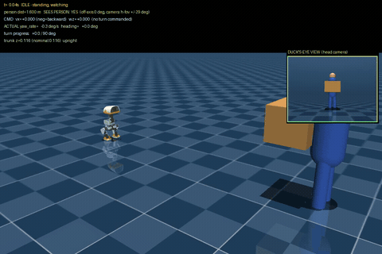

# move-away-head-tracking — moving aside without losing sight of the person

A conservative evolution of [`../move-away-early-camera`](../move-away-early-camera),
created on 2026-08-31. The previous best baseline remains untouched.

It preserves the validated maneuver exactly:

```
IDLE → RETREAT → TURN → CLEAR → DONE
```

It adds an independent gaze layer that aims the head's yaw and pitch toward the
person throughout the sequence. The video lasts 22 seconds: the person keeps
walking for 3 seconds longer than in the 19-second baseline.

## Demo

[](media/move-away-head-tracking.mp4)

▶️ **[Watch or download the full MP4 video (22 s, 50 fps)](media/move-away-head-tracking.mp4)**

The main view shows the full maneuver, while the upper-right PiP is the duck's
real camera tracking the person. Click the animation to open the original video.

## Validated results

- **Visibility:** `1100/1100` control steps; `lost_steps=0`.
- **Maximum angular error:** `1.2°` from the camera center.
- **Motion:** same transition sequence and trajectory as the validated baseline.
- **Final stability:** upright in `DONE`, with `trunk z=0.116`.
- **Video:** 22 s, 960×640, 50 fps, H.264.
- **PiP:** 225×165 px, upper-right corner.

## Running it

From a `microduck_rl` checkout with its environment (`mujoco`, `onnxruntime`,
`imageio`, Pillow, and ffmpeg):

```bash
python scripts/render_phase1.py \
  --seconds 22 --out /tmp/move-away-head-tracking --fps 50
ffmpeg -framerate 50 -i /tmp/move-away-head-tracking/f%05d.png \
  -c:v libx264 -pix_fmt yuv420p -movflags +faststart \
  media/move-away-head-tracking.mp4
```

Place `assets/scene_yield.xml` under `src/mjlab_microduck/robot/microduck/`
and `onnx/alpha_walking.onnx` under `onnx/`.

## How tracking works

The direction from the camera to the person's torso is projected onto the real
optical axes of `head_camera`. A visual servo corrects:

- `head_yaw`: horizontal error;
- `head_pitch`: vertical error.

The camera follows MuJoCo's convention (`-Z` is forward and `+Y` is up) and
retains the optical-frame correction introduced in the previous version.
Visibility is checked against the PiP's real frustum and through a scene ray cast.

### Separating gaze from locomotion

The head represents a large fraction of microduck's total mass. Two experiments
that moved it physically while walking caused the robot to fall, even when the
policy's stabilizing output was preserved. The locomotion ONNX policy was not
trained to compensate for an external head trajectory.

This version therefore uses an **independent kinematic gaze layer**:

1. locomotion physics and policy inference advance in the original `MjData`,
   unchanged from the stable baseline;
2. perception and rendering use an isolated `MjData` copy whose head yaw and
   pitch are aimed at the person;
3. that pose is never fed back into the locomotion dynamics.

This mirrors the proper separation between gaze and locomotion controllers on
the physical robot, and avoids claiming dynamic stability that the current
policy cannot actually provide.

## Inherited parameters — unchanged

- reaction: `RETREAT_D = 1.15 m`, person starts at `x0 = 1.60 m`;
- `VX_RETREAT = -0.28`;
- `VX_ROTATE = -0.31`;
- `RETREAT_HOLD = 5.0 s`;
- `CLEAR_HOLD = 2.5 s`;
- `TURN_CUT = 45°`;
- `CMD_TAU = 0.08`.

`move-away-early-camera/` was never modified; this variant lives entirely in
its own folder.
